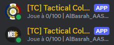

<div align="center">

<br>


<h1 align="center">SquadPop</h1>
<h4 align="center">A JavaScript Discord bot to display the population of your favorite servers </h4>

<p align="center">
    <a href="https://github.com/Nicolas-Colombier/SquadPop#overview">Overview</a> •
    <a href="https://github.com/Nicolas-Colombier/SquadPop#requirements">Requirements</a> •
    <a href="https://github.com/Nicolas-Colombier/SquadPop#dependencies">Dependencies</a> •
    <a href="https://github.com/Nicolas-Colombier/SquadPop#discord-bot-identity">Discord bot identity</a> •
   <a href="https://github.com/Nicolas-Colombier/SquadPop#installation">Installation</a> •
    <a href="https://github.com/Nicolas-Colombier/SquadPop#running-the-bot">Running the bot</a> •
    <a href="https://github.com/Nicolas-Colombier/SquadPop#usage--management">Usage & Management</a> •
    <a href="https://github.com/Nicolas-Colombier/SquadPop#credits">Credits</a>
</p>


</div>

<br>

## Overview

**SquadPop** is a Discord bot adapted to display the population of your favorite Squad servers on any Discord server. It does not require RCON access to the Squad server, and use the BattleMetrics API to get the information. You can display the population of multiple servers at the same time.

If you need help, contact me on Discord : **nom4de**

<br>

## Requirements
* Linux but can be adapted to Windows
* Git
* [Node.js](https://nodejs.org/en/)
* [BattleMetrics API key](https://www.battlemetrics.com/developers)

<br>

## Dependencies
**Discord.js** <br>
Powerful Node.js module that allows you to easily interact with the Discord API.
[See on npm](https://www.npmjs.com/package/discord.js)

**axios** <br>
Promise based HTTP client for the browser and node.js.
[See on npm](https://www.npmjs.com/package/axios)

<br>

## Discord bot identity

1. Go to the [Discord Developer Portal](https://discord.com/developers/applications) and create a new application.
2. In the general information tab, enter the name of your bot (this is only the developer portal's name) and the description you want. You can also add a profile picture.
3. Then go the the bot tab and add the name you want to display inside Discord. If you need a banner, this is also the place to do it.
4. You can now reset the token and copy it in the `config.json` file as the `botToken` for each server. **DO NOT SHARE THIS TOKEN WITH ANYONE** (if you do, regenerate it).
5. Go to the OAuth2 tab and select `bot` in the OAuth2 URL Generator. Then select the permissions you want to give to your bot (I suggest giving it administrator permissions for your server). Select Guild Install as the integration type. You can generate a different link for each server you want to add the bot to.
6. Copy the generated link and paste it in your browser. You can now add your bot to your server if you are admin.
7. Create as many bots as you have servers to display the population.

<br>

## Installation

1. Clone the repository (or download the zip) :

```sh
git clone https://github.com/Nicolas-Colombier/SquadPop.git
```

2. Go to the bot directory :

```sh
cd SquadPop
```

3. Install `npm` dependencies :

```sh
npm install
```

4. Create a `config.json` file using the `config.json.example` template :

```sh
cp config.json.example config.json
```

5. Edit the `config.json` file and add your Discord bot token, your BattleMetrics API key, the server BattleMetrics ID and the server name :

- `server` : Each object is a server, if you have more then just add more object (be careful of the syntaxe). Each server can be on a different machine or user but need SSH access.
- `botToken` : The token of your bot.
- `battleMetricsToken` : Your BattleMetrics API key (you can get it on the [BattleMetrics website](https://www.battlemetrics.com/developers)).
- `battleMetricsServerId` : The BattleMetrics ID of the server (can be found in the URL of the server page).

<br>

## Running the bot

1. Create a systemd service to run the bot (from this point requires sudo access):

```sh
nano /etc/systemd/system/squadpop.service
```

2. Add the following content :

```
[Unit]
Description=Squad Pop

[Service]
Type=simple
User=name_of_your_linux_user
WorkingDirectory=/home/****/path_to_the_bot
ExecStart=/usr/bin/node /home/****/path_to_the_bot/main.js
Restart=always
RestartSec=10
StandardOutput=syslog
StandardError=syslog
SyslogIdentifier=name_of_your_linux_user

[Install]
WantedBy=multi-user.target
```

3. Reload the service files to include the new service (requires sudo access) :

```sh
sudo systemctl daemon-reload
```

4. Start the bot (requires sudo access) :

```sh
sudo systemctl start squadpop
```

5. Check the status of the bot (requires sudo access) :

```sh
sudo systemctl status squadpop
```

6. Enable the bot to start on boot (requires sudo access) :

```sh
sudo systemctl enable squadpop
```

<br>

## Usage & Management

To disable the bot to start on boot (requires sudo access) :

```sh
sudo systemctl disable squadpop
```

Stop the bot (requires sudo access) :

```sh
sudo systemctl stop squadpop
```

Take a look to the logs (requires sudo access) :

```sh
sudo journalctl -u squadpop
```
```sh
sudo journalctl -fu squadpop
```

<br>

## Credits

- [Foxinou](https://github.com/FoxinouFR) - For the original idea and the first version of the bot
